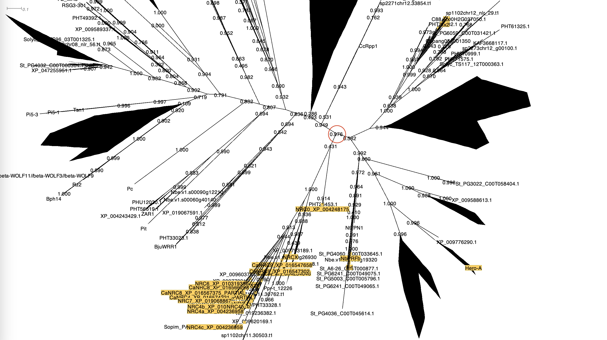
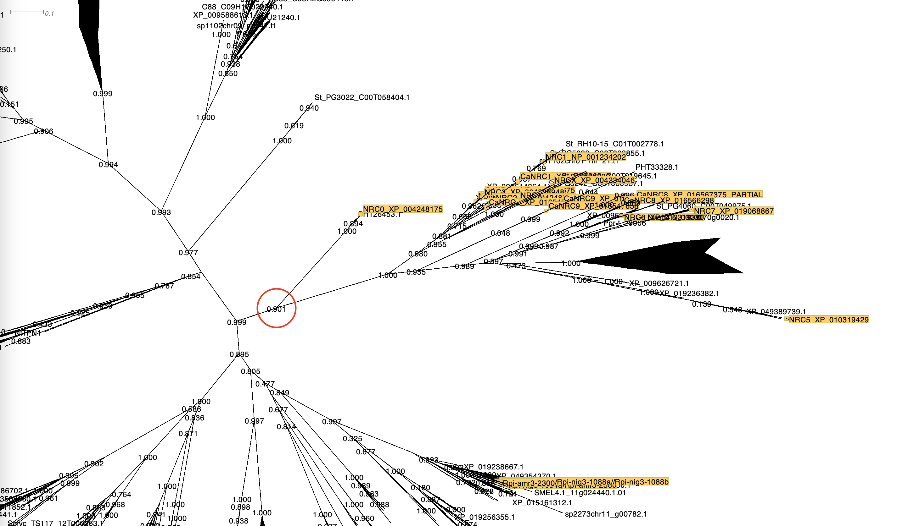

1. To extract the NRC clade and NRC helpers, we first made a [phylogenetic tree of all NLRs from 124 genomes based on the NBARC domains](phylogenetics/NBARC_ref_filtered.newick). Then a well-supported branch comprising both NRC helpers and sensors was selected and extracted *Dendroscope* (Options > Advanced Options > Extract Subnetwork...) from the phylogenetic tree ([NRC.tree](phylogenetics/NRC.tree)):

2. The extracted sequences were aligned again and a new phylogenetic tree of the NRC network was made using the alignment ([NRC_i2.newick](phylogenetics/NRC_i2.newick)). Next, the well-supported branch containing all reference NRC helpers was selected and extracted in the same way as before for the NRC helper clade:

3. Finally, [NRC helper subclades](phylogenetics/clades) were extracted from the curated [NRC helper sequences](phylogenetics/NRCH_clu_NBARC_filtered_ref.fasta) and the [phylogenetic tree](phylogenetics/NRCH_clu_NBARC_filtered_ref.newick) made from them and based on reference NRC sequences' presence.
